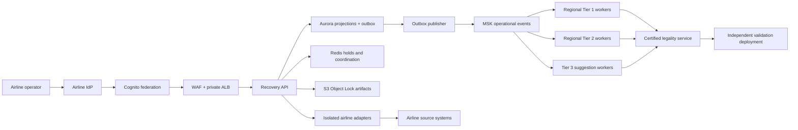

# SkySolver production architecture

> Target architecture with an explicit current-state boundary. Nothing in this
> document grants operational authority. The checked-in application remains a
> synthetic, non-certified recovery demonstrator with carrier writes disabled.

## Safety boundary

The system can enter controlled production only after authoritative airline
adapters, certified operator rules, independent validation, security approval,
shadow-mode acceptance, resilience evidence and two-person deployment controls
have passed their release gates. A UI action is never evidence of publication.

Current executable capabilities:

- Python Tier 1 and heuristic Tier 2 recovery over Indian synthetic fixtures.
- DGCA-oriented demo constraints; not a complete or certified DGCA ruleset.
- Human-review workflow, signed demo sessions and centralized role policy.
- Typed FastAPI/OpenAPI contracts with version and idempotency requirements.
- Local JSON recovery state and audit history; mutable and non-authoritative.
- React scheduler interface and per-flight Indian route fixtures.

Not currently operational:

- Carrier integrations or source-system acknowledgements.
- Aurora/MSK/Redis/S3 runtime repositories.
- MILP/column generation or an independently certified rules execution path.
- Cognito federation, airline MFA, step-up authentication or live IdP groups.
- Immutable audit, production telemetry, certified scale, DR, or carrier writes.

## Target runtime

All compute runs on private EKS subnets across three availability zones. EKS
deployments are separate for API, ingestion, projections, tiers, legality,
independent validation, outbox publication, reconciliation and each adapter.
Service accounts use IRSA and least-privilege IAM. Images are immutable,
digest-pinned and signature-verified before promotion.

## Regional partitioning

The primary ordering key is `(tenant, region, resource)`. A region is an
operator-approved operational partition based on crew bases, stations and
recovery control responsibility—not merely an airport code. Tier jobs consume
only their versioned input snapshot and may return partial legal coverage.

Cross-partition resource movement is a saga:

1. Reserve the source resource.
2. Reserve destination capacity.
3. Validate legality and physical movement against one signed snapshot.
4. Commit both partitions or emit compensating releases.
5. Reconcile acknowledgements from both source systems.
6. Complete the audit only after confirmed commit.

There is no percentage threshold that silently defers legal reconciliation.

## Tier race

- **Tier 1:** fast, regionally isolated heuristic. It returns a legal incumbent
  or partial legal coverage within its timebox and records every rejection.
- **Tier 2:** actual MILP/constraint-programming upgrade in the target system.
  It accepts the Tier 1 incumbent and may replace it only when its snapshot is
  current, legality certificate is valid and objective result is meaningfully
  better. The current Python implementation is only a heuristic upgrade.
- **Tier 3:** independently available unresolved-case queue. Suggestions remain
  usable when automated tiers or optimizer infrastructure fail. Every edit is
  independently revalidated.

Tiers race and escalate; they are not a single blocking animation.

## Authoritative data and state

Canonical records live in `core/canonical.py`. Each record has canonical and
source IDs, tenant, version, provenance, freshness and data-quality findings.
Operational instants retain UTC, local airport time, IANA timezone and operating
date.

Aurora is the transactional write model and projection store. An append locks
the aggregate version, inserts an operational event, advances its version and
inserts a transactional outbox row atomically. MSK is the durable distribution
log. Consumers record event IDs and offsets for idempotent replay. Redis is
never authoritative. Signed input, candidate, validation, deployment and replay
artifacts are retained in versioned Object-Locked S3.

The initial schema is in `infrastructure/migrations/001_operational_event_store.sql`.

## Legality and feasibility

Optimization cannot embed or bypass hard rules. A signed, effective-dated
rules package is approved by four-eyes governance, shadow evaluated and
executed by the legality service. Independent validation uses the identical
snapshot and rules package through a separately deployed execution path.

A candidate becomes deployable only when crew, aircraft, airport, passenger,
movement and temporary-hold feasibility all pass. The trace contains exact
inputs, arithmetic, rule identifiers, ruleset version and execution identity.
Software tests cannot self-certify DGCA or operator compliance.

## Approval and publishing

Authorization is enforced server-side:

- Scheduler or recovery manager proposes.
- Duty manager independently approves with a reason.
- Deployment controller performs step-up authentication and publishes.
- The proposer cannot approve the same recovery.

Publication freezes the candidate, checks freshness, independently revalidates,
reserves resources and writes per-system commands to the outbox. Completion
requires all mandatory ACKs and reconciliation. Partial ACK, NACK or timeout is
shown as partial. Published operational changes are compensated where possible;
irreversible actions require a new recovery and are never called rollback.

## Infrastructure and environments

`infrastructure/terraform` defines the initial AWS baseline: three-AZ VPC,
private EKS, Aurora PostgreSQL, IAM-authenticated MSK, encrypted Redis, KMS,
Object-Locked S3, immutable ECR, Secrets Manager and Cognito. Kubernetes
manifests enforce non-root containers, read-only filesystems, topology spread,
PDB, network policy, IRSA and Kafka-lag autoscaling.

Separate state/accounts are required for development, integration, airline
sandbox, shadow production, controlled production and disaster recovery.
Terraform is not yet applied or validated against an airline AWS account.

## Exit gates

1. **Containment:** truthful synthetic labeling, identity boundary, dead controls
   removed and carrier writes impossible.
2. **Data foundation:** authoritative read adapters, replayable Aurora/MSK state,
   reconciled freshness and blocking data-health findings.
3. **Decision certification:** complete approved rules, real Tier 2, resilient
   Tier 3, joint feasibility and reproducible candidate artifacts.
4. **Shadow pilot:** live read-only data, security/accessibility/resilience tests
   and airline safety-board acceptance.
5. **Controlled publishing:** one approved carrier/region/fleet/action type,
   dual approval, step-up auth, ACK/NACK reconciliation and staffed procedures.
6. **Expansion:** certified load, multi-region DR, formal production acceptance,
   support and rules/model governance.
